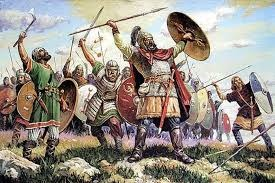

# Visigodos

Los visigodos fueron distintos pueblos bárbaros que, sin encontrar oposición, se
adentraron en Hispania. Este hecho coincide con el declive del Imperio romano. Se
estableció un tratado en el cual se disponía que los visigodos se asentaran en el sur de
la Galia y controlaran algunos territorios en Hispania.

## Índice
1. [Epoca](epoca.md)
2. [Arquitectura](arquitectura.md)
3. [Obras.md](obras.md)

##Referencia

[Instituto](https://www.ign.es/web/ign/portal)
